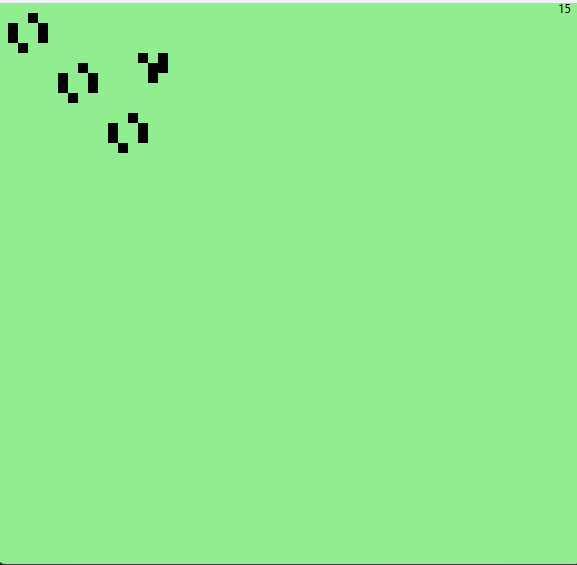

# Game of life

Demo project of [Conway's Game of Life](https://en.wikipedia.org/wiki/Conway%27s_Game_of_Life) in scala + javafx

# Requirements

* [sbt](https://www.scala-sbt.org/download/) (tested with sbt 1.10.4)
* a JDK (test with JDK 21) (can be installed through [SDKMAN](https://sdkman.io/usage/))

# Usage

```
sbt run
```

It should open a window and start a game of life. Initial state is configured at the end of [src/main/scala/game/GameModel.scala](src/main/scala/game/GameModel.scala)

